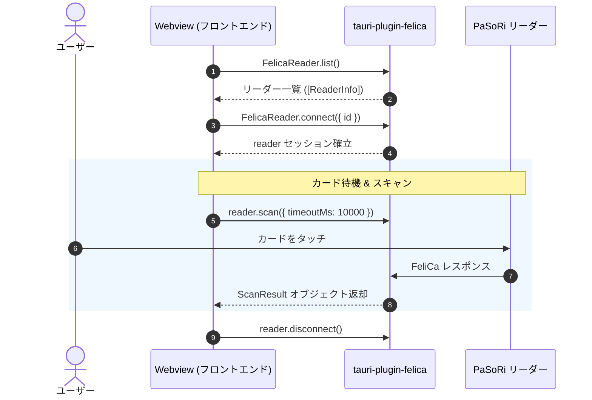

# チュートリアル：カードを読み取る

このチュートリアルでは、高レベル API である `FelicaReader.scan()` を利用して、PaSoRi にカードがかざされたことを検知し、残高や履歴データを取得する実践的な手順を解説します。

---

## 読み取りの基本ライフサイクル

カード読み取りの一連の処理は、以下の 4 つのステップで構成されます。



1. **リーダーの検索 (`FelicaReader.list()`)**: PC に接続されている PaSoRi を取得。
2. **リーダーへの接続 (`FelicaReader.connect()`)**: リーダーをオープンし、通信セッションを開始。
3. **カードの待機とスキャン (`reader.scan()`)**: カードがかざされるのを待ち、無鍵データを一括読み取り。
4. **リーダーの切断 (`reader.disconnect()`)**: 通信セッションを終了し、デバイスを解放。

---

## 基本的な実装例 (TypeScript)

もっともシンプルなカード読み取りのコードです。

```typescript
import { FelicaReader, FelicaError } from "tauri-plugin-felica-api";

async function readCardSample() {
  // 1. 接続されている PaSoRi を検出
  const readers = await FelicaReader.list();
  if (readers.length === 0) {
    console.error(
      "PaSoRi リーダーが見つかりません。USB接続を確認してください。",
    );
    return;
  }

  console.log(`検出されたリーダー: ${readers[0].name} (${readers[0].chipset})`);

  // 2. 最初のリーダーに接続
  const reader = await FelicaReader.connect({ id: readers[0].id });

  try {
    console.log("カードをリーダーにかざしてください (最大10秒間待機)...");

    // 3. スキャン実行（タイムアウト10秒）
    const result = await reader.scan({ timeoutMs: 10000 });

    console.log(`IDm: ${result.idm}`);
    console.log(`検出された製品: ${result.products.join(", ")}`);

    // 交通系 IC の場合
    if (result.transit) {
      console.log(
        `【交通系IC】残高: ¥${result.transit.balance?.toLocaleString()}`,
      );
      for (const history of result.transit.histories) {
        const entry = history.entry?.label ?? "未記録";
        const exit = history.exit?.label ?? "未記録";
        console.log(
          `[${history.date}] ${history.processType.label}: ${entry} → ${exit} (残高: ¥${history.balance})`,
        );
      }
    }

    // WAON の場合
    if (result.waon) {
      console.log(`【WAON】残高: ¥${result.waon.balance.toLocaleString()}`);
      if (result.waon.points !== undefined) {
        console.log(`ポイント: ${result.waon.points} pt`);
      }
    }

    // 楽天Edy の場合
    if (result.edy) {
      console.log(`【楽天Edy】残高: ¥${result.edy.balance.toLocaleString()}`);
    }

    // nanaco の場合
    if (result.nanaco) {
      console.log(`【nanaco】残高: ¥${result.nanaco.balance.toLocaleString()}`);
      if (result.nanaco.points !== undefined) {
        console.log(`ポイント: ${result.nanaco.points} pt`);
      }
    }
  } catch (err) {
    if (err instanceof FelicaError) {
      if (err.code === "SCAN_TIMEOUT") {
        console.warn("時間内にカードがかざされませんでした。");
      } else if (err.code === "UNSUPPORTED_CARD") {
        console.warn("対応していないカードです。");
      } else {
        console.error(`エラーが発生しました [${err.code}]: ${err.message}`);
      }
    } else {
      console.error("予期せぬエラー:", err);
    }
  } finally {
    // 4. 必ずセッションを切断する
    await reader.disconnect();
  }
}
```

---

## スキャンオプション (`ScanOptions`)

`reader.scan(options)` には以下のオプションを指定できます。

| プロパティ | 型 | 既定値 | 説明 |
| :-- | :-- | :-- | :-- |
| `timeoutMs` | `number` | なし (無限待機) | カードが検出されるまでのタイムアウト（ミリ秒）。カード検出後のデータ読み取り処理には適用されません。 |
| `targets` | `FelicaType[]` | すべて | 読み取り対象の製品を指定します（例: `[FelicaTypes.TRANSIT]`）。対象外の製品ブロックの読み取りをスキップして高速化できます。 |
| `require` | `boolean` | `false` | `true` の場合、`targets` に合致するカードがかざされるまで待機を継続します。`false` の場合、異なるカードがかざされると即座に `CARD_TYPE_MISMATCH` エラーをスローします。 |
| `detail` | `boolean` | `false` | 交通系ICにおいて、追加の改札入場記録（`0x108F`）や特急券・グリーン券情報（`0x184B`）まで取得します。 |
| `signal` | `AbortSignal` | なし | スキャン待機をキャンセルするための `AbortSignal` です。 |

### 交通系ICのみを対象とする例

```typescript
import { FelicaReader, FelicaTypes } from "tauri-plugin-felica-api";

const result = await reader.scan({
  targets: [FelicaTypes.TRANSIT], // 交通系ICのみ読み取る
  require: true, // 交通系ICがかざされるまで待機する
  timeoutMs: 15000,
});
```

---

## スキャンのキャンセル

画面遷移時やユーザーが「キャンセル」ボタンを押した際には、スキャン待機を安全に中断する必要があります。

### 方法 1: `AbortController` を使用する（推奨）

```typescript
const controller = new AbortController();

// キャンセルボタン押下時に controller.abort() を呼ぶ
cancelButton.addEventListener("click", () => {
  controller.abort();
});

try {
  const result = await reader.scan({
    signal: controller.signal,
  });
} catch (err) {
  if (err instanceof FelicaError && err.code === "SCAN_CANCELLED") {
    console.log("スキャンがキャンセルされました。");
  }
}
```

### 方法 2: `reader.cancelScan()` を使用する

セッションインスタンスに対して明示的にキャンセルを発行することも可能です。

```typescript
await reader.cancelScan();
```

---

## React での実装パターン

React コンポーネント内でスキャンを行う場合の一般的なパターンです。

```tsx
import React, { useState, useRef, useEffect } from "react";
import { FelicaReader, FelicaError, ScanResult } from "tauri-plugin-felica-api";

export function CardScanner() {
  const [isScanning, setIsScanning] = useState(false);
  const [scanResult, setScanResult] = useState<ScanResult | null>(null);
  const [errorMessage, setErrorMessage] = useState<string | null>(null);
  const abortControllerRef = useRef<AbortController | null>(null);

  const startScan = async () => {
    setIsScanning(true);
    setErrorMessage(null);
    setScanResult(null);

    const abortController = new AbortController();
    abortControllerRef.current = abortController;

    let reader: FelicaReader | null = null;
    try {
      const readers = await FelicaReader.list();
      if (readers.length === 0) {
        throw new Error("PaSoRi リーダーが接続されていません。");
      }

      reader = await FelicaReader.connect({ id: readers[0].id });

      const result = await reader.scan({
        timeoutMs: 10000,
        signal: abortController.signal,
      });

      setScanResult(result);
    } catch (err) {
      if (err instanceof FelicaError && err.code === "SCAN_CANCELLED") {
        setErrorMessage("スキャンがキャンセルされました。");
      } else if (err instanceof FelicaError && err.code === "SCAN_TIMEOUT") {
        setErrorMessage("タイムアウトしました。カードをかざしてください。");
      } else {
        setErrorMessage(
          err instanceof Error ? err.message : "エラーが発生しました。",
        );
      }
    } finally {
      if (reader) {
        await reader.disconnect();
      }
      setIsScanning(false);
      abortControllerRef.current = null;
    }
  };

  const cancelScan = () => {
    abortControllerRef.current?.abort();
  };

  // アンマウント時に自動的にスキャンを中断
  useEffect(() => {
    return () => {
      abortControllerRef.current?.abort();
    };
  }, []);

  return (
    <div className='card-scanner'>
      <h2>FeliCa カードリーダー</h2>

      {!isScanning ? (
        <button onClick={startScan}>スキャン開始</button>
      ) : (
        <button onClick={cancelScan}>キャンセル</button>
      )}

      {isScanning && <p>カードをタッチしてください...</p>}
      {errorMessage && <p style={{ color: "red" }}>{errorMessage}</p>}

      {scanResult && (
        <div className='result'>
          <h3>読み取り完了</h3>
          <p>IDm: {scanResult.idm}</p>
          {scanResult.transit && (
            <p>交通系残高: ¥{scanResult.transit.balance?.toLocaleString()}</p>
          )}
          {scanResult.waon && (
            <p>WAON 残高: ¥{scanResult.waon.balance.toLocaleString()}</p>
          )}
          {scanResult.edy && (
            <p>Edy 残高: ¥{scanResult.edy.balance.toLocaleString()}</p>
          )}
          {scanResult.nanaco && (
            <p>nanaco 残高: ¥{scanResult.nanaco.balance.toLocaleString()}</p>
          )}
        </div>
      )}
    </div>
  );
}
```

---

次のステップ: **[カード別読み取りガイド](Card-Guides)** で、各カードで取得できる詳細なデータ構造を確認しましょう。
